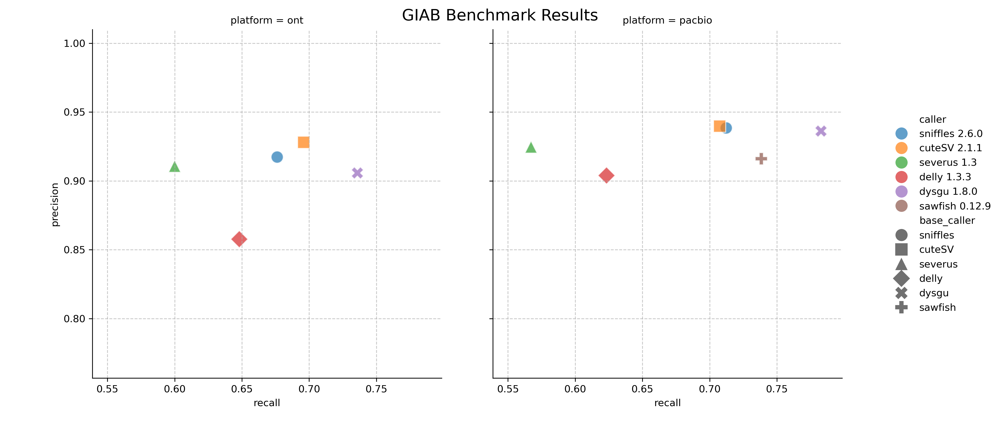
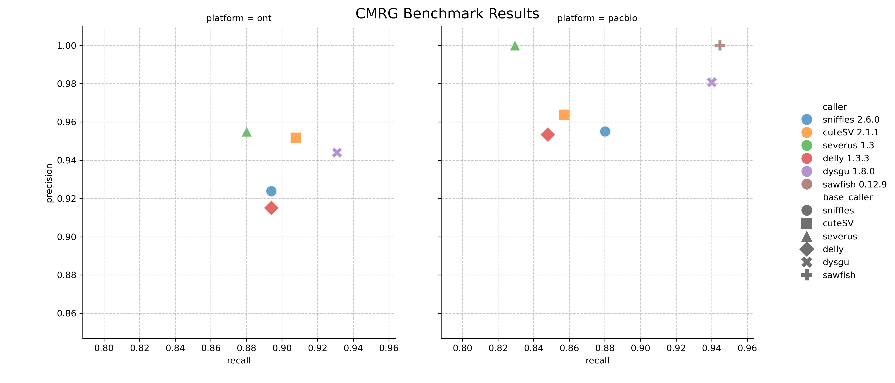

# :bar_chart: Long-read SV Benchmark CMRG/GIAB

This is a reproducible alignment and benchmark of structural variants for the GIAB benchmark datasets:
- The Genome In A Bottle (GIAB) truthset v1.1 is assessed. [GIAB](https://www.nist.gov/programs-projects/genome-bottle)


## Requirements

- Linux machine
- ~200 Gb space, 32 gb Ram, 4 cores
- [Nextflow](https://www.nextflow.io/docs/latest/install.html)

## Reads

- ONT reads (~40X coverage) 'Kit14'
- PacBio Vega HiFi (~30X coverage)

## Aligners
- minimap2
- bwa-mem
- last
- ngmlr
- vacmap
- mmbwa


## Callers
- [sniffles](https://github.com/fritzsedlazeck/Sniffles)
- [cuteSV](https://github.com/tjiangHIT/cuteSV)
- [delly](https://github.com/dellytools/delly)
- [sawfish](https://github.com/PacificBiosciences/sawfish)
- [dysgu](https://github.com/kcleal/dysgu)

For benchmarking [truvari v5.2](https://github.com/ACEnglish/truvari) was used.

## Results







### ONT Results:
| caller         | platform   | Benchmark   |      TP |   FP |    FN |   precision |   recall |     f1 |   gt_concordance |
|:---------------|:-----------|:------------|--------:|-----:|------:|------------:|---------:|-------:|-----------------:|
| sniffles 2.6.0 | ont        | CMRG        |     194 |   16 |    23 |      0.9238 |   0.894  | 0.9087 |           0.8763 |
| cuteSV 2.1.1   | ont        | CMRG        |     197 |   10 |    20 |      0.9517 |   0.9078 | 0.9292 |           0.8934 |
| severus 1.3    | ont        | CMRG        |     191 |    **9** |    26 |      **0.955**  |   0.8802 | 0.9161 |           0.5864 |
| delly 1.3.3    | ont        | CMRG        |     194 |   18 |    23 |      0.9151 |   0.894  | 0.9044 |           0.8866 |
| dysgu 1.8.0    | ont        | CMRG        |     **202** |   12 |    **15** |      0.9439 |   **0.9309** | **0.9374** |           **0.9208** |
| sniffles 2.6.0 | ont        | GIAB        |   19062 | 1704 |  9126 |      0.9173 |   0.6762 | 0.7785 |         nan      |
| cuteSV 2.1.1   | ont        | GIAB        |   19618 | **1500** |  8570 |      **0.9281** |   0.696  | 0.7954 |         nan      |
| severus 1.3    | ont        | GIAB        |   16913 | 1642 | 11275 |      0.9107 |   0.6    | 0.7234 |         nan      |
| delly 1.3.3    | ont        | GIAB        |   18268 | 3010 |  9920 |      0.8577 |   0.6481 | 0.7383 |         nan      |
| dysgu 1.8.0    | ont        | GIAB        | **20743** | 2136 |  **7445** |      0.9058 |   **0.7359** | **0.812**  |         nan      |

### PacBio Results:

| caller         | platform   | Benchmark   |    TP |   FP |    FN |   precision |   recall |     f1 |   gt_concordance |
|:---------------|:-----------|:------------|------:|-----:|------:|------------:|---------:|-------:|-----------------:|
| sniffles 2.6.0 | pacbio     | CMRG        |   191 |    9 |    26 |      0.955  |   0.8802 | 0.9161 |           0.9162 |
| cuteSV 2.1.1   | pacbio     | CMRG        |   186 |    7 |    31 |      0.9637 |   0.8571 | 0.9073 |           0.8871 |
| severus 1.3    | pacbio     | CMRG        |   180 |    **0** |    37 |      **1**      |   0.8295 | 0.9068 |           0.5833 |
| delly 1.3.3    | pacbio     | CMRG        |   184 |    9 |    33 |      0.9534 |   0.8479 | 0.8976 |           0.8859 |
| sawfish 0.12.9 | pacbio     | CMRG        |   **205** |    **0** |    **12** |      **1**      |   **0.9447** | **0.9716** |           **0.961**  |
| dysgu 1.8.0    | pacbio     | CMRG        |   204 |    4 |    13 |      0.9808 |   0.9401 | 0.96   |           0.9314 |
| sniffles 2.6.0 | pacbio     | GIAB        | 20079 | 1306 |  8109 |      0.9384 |   0.7123 | 0.8099 |         nan      |
| cuteSV 2.1.1   | pacbio     | GIAB        | 19940 | **1264** |  8248 |      **0.9397** |   0.7074 | 0.8072 |         nan      |
| severus 1.3    | pacbio     | GIAB        | 15988 | 1290 | 12200 |      0.9246 |   0.5672 | 0.7031 |         nan      |
| delly 1.3.3    | pacbio     | GIAB        | 17570 | 1850 | 10618 |      0.9039 |   0.6233 | 0.7378 |         nan      |
| sawfish 0.12.9 | pacbio     | GIAB        | 20812 | 1883 |  7376 |      0.9161 |   0.7383 | 0.8177 |         nan      |
| dysgu 1.8.0    | pacbio     | GIAB        | **22066** | 1486 |  **6122** |      0.9362 |   **0.7828** | **0.8527** |         nan      |


## How to repeat

```bash
bash fetch_data.sh
nextflow run pipeline.nf
```

## Notes

Truvari refine was used on the GIAB benchmark. For the CMRG benchmark, refine was not run as most vcfs triggered errors using this step.

Truvari parameters were:
    
    --passonly -r 1000 --dup-to-ins -p 0 --sizemax 50000
    
To modify parameters, edit the nextflow.config file.


## Contributing

Happy to accept PR's to add other callers to this benchmark, so long as:
- The caller works with the input data (bam and cram files)
- The caller requires < 5 hours to process a sample, and consumes < 32 Gb memory
- The caller can be reliably installed without editing the source code
